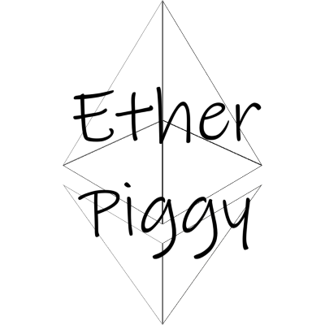

# 🐷 Ether-Piggy

Ether-Piggy is a decentralized piggy bank application built on the Ethereum blockchain. It enables users to lock away funds until a specified unlock date, promoting savings and financial discipline through smart contracts.

## 🚀 Features

- 🔒 Lock Ether into your personal piggy bank
- ⏳ Set a time-based unlock date
- 🔓 Withdraw funds only after the unlock time has passed
- 🧾 Transparent, secure, and verifiable on-chain

## 🛠️ Getting Started

### Prerequisites

- Node.js
- npm
- Hardhat
- MetaMask or any Web3-enabled wallet

### Installation

1. **Clone the repository**

```bash
git clone https://github.com/thunder-thigh/Ether-Piggy.git
cd Ether-Piggy
```

---
## ⚙️ Getting Started

### Prerequisites

- Node.js & npm
- MetaMask (or any Web3-enabled wallet)
- Hardhat
- Git

---

### 🧪 Smart Contract Setup

1. **Navigate to the contracts folder**

```bash
cd smart-contracts
```

2. **Install dependencies**

```bash
npm install
```

3. **Compile Contracts**

```bash
npx hardhat compile
```

4. **Deploy to local or testnet**

```bash
npx hardhat run script/deploy.js --network <network>
```
Replace <network> with localhost, sepolia, or your preferred network (ensure it's configured in hardhat.config.js).

5. **Install dependencies if needed**

```bash
npm install --save-dev hardhat @nomicfoundation/hardhat-toolbox dotenv
```
